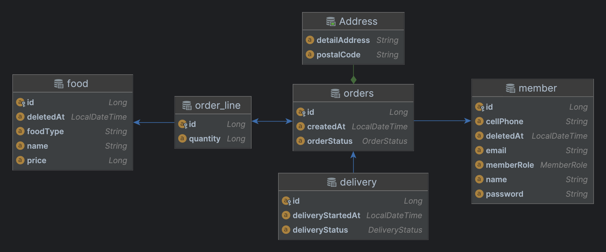

# 배달어플 API

URL / HTTP Method

### 음식(구현완료)
- 판매 음식 전체 조회 - `GET /foods` - 판매점, 사용자
- 판매 음식 조회 - `GET /foods/{id}` - 판매점, 사용자
- 판매 음식 등록 - `POST /foods` - 판매점
- 판매 음식 수정 - `PUT /foods/{id}` - 판매점
- 판매 음식 삭제 - `DELETE /foods/{id}` - 판매점

### 회원(구현완료)
- 전체 회원 조회 - `GET /members` - 판매점
- 회원 조회 - `GET /members/{id}` - 판매점, 사용자
- 회원 등록 - `POST /members` - 판매점, 사용자
- 회원 수정 - `PUT /members/{id}` - 판매점, 사용자
- 회원 삭제 - `DELETE /members/{id}` - 판매점, 사용자

### 주문(구현완료)
- 전체 주문 조회 - `GET /orders` - 판매점
- 주문 조회 - `GET /orders/{id}` - 판매점
- 주문 하기 - `POST /orders` - 사용자
- 주문 수락 - `PATCH /orders/{id}/accept` - 판매점
- 주문 취소 - `PATCH /orders/{id}/cancel` - 사용자
- 주문 거절 - `PATCH /orders/{id}/reject` - 판매점
- 사용자의 주문 조회 - `GET /orders/members/{id}` - 판매점, 사용자
- 현재 접수중인 모든 주문 조회 -  `GET /orders/accepting` - 판매점

### 배달
- 전체 배달 조회 - `GET /deliveries` - 판매점
- 배달 조회 - `GET /deliveries/{id}` - 판매점, 사용자
- 배달 등록 - `POST /deliveries` - 판매점
- 배달 시작 - `PATCH /deliveries/{id}/start` - 판매점
- 배달 취소 - `DELETE /deliveries/{id}` - 판매점
- 배달 완료 - `POST /deliveries/{id}/complete` - 판매점

---
## MySQL 다이어그램

## 엔티티 다이어그램
